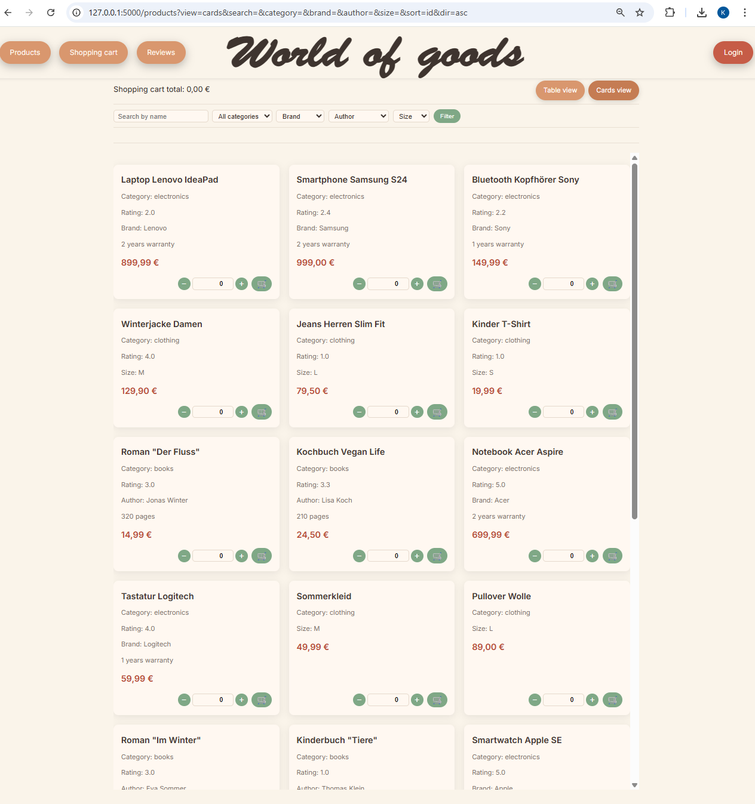

# 🛒 Warenwelt – Full-Stack Online Shop (Flask + MySQL)

Warenwelt is a full-stack online shop application developed as a learning project to simulate a real-world e-commerce system.

The goal of this project was not only to build a web application, but to understand how backend logic, database design, and user interaction work together in one system.

💡 This project combines:
- a web interface for users (Flask + HTML/CSS/JS)
- a CLI tool for administration and testing
- a structured MySQL database

---

## 🚀 What I built

In this project, I designed and implemented:

- a complete backend architecture using Flask
- a relational database with normalized structure (MySQL)
- business logic for orders, customers, and products
- a session-based shopping cart system
- product filtering and search functionality
- user authentication (login/logout)
- review system with validation rules
- invoice generation

---

## 🧠 What I learned

Through this project I gained practical experience in:

- object-oriented programming in Python
- designing relational databases
- building REST-like structures in Flask
- separating concerns (controllers, models, views)
- handling user input and validation
- connecting frontend and backend

---

## 🚀 Main features

### 👤 Customer management
- create private and company customers
- validate input fields:
  - email
  - phone number
  - birthdate
  - company number
  - password
- update and delete customer data
- login and logout via web interface
- profile page for logged-in users

---

### 📦 Product management
- manage products in three categories:
  - Books
  - Electronics
  - Clothing
- category-specific fields:
  - books → author, page count
  - electronics → brand, warranty years
  - clothing → size
- create, update, delete, and filter products
- search by category and maximum price
- display products in table or card view

---

### ⭐ Reviews
- customers can create reviews only for purchased products
- one review per customer per product
- product rating summaries
- customer rating summaries
- review deletion
- filtering and sorting in the web interface

---

### 🛒 Shopping cart and orders
- add products to cart
- change quantity directly in the cart
- calculate total price
- company discount logic
- save orders in the database
- show order history
- checkout with shipping method selection

---

### 🧾 Invoice generation
- automatic TXT invoice creation
- invoice contains:
  - customer data
  - ordered items
  - subtotal
  - company discount
  - final total

---

### 🗄 Database layer
- normalized MySQL database
- separate tables:
  - customers
  - private_customer
  - company_customer
  - product
  - books / electronics / clothing
  - review
  - orders
  - order_items
- SQL views for cleaner data presentation

---

## 🛠 Technologies used

- Python
- Flask
- MySQL
- PyMySQL
- Pydantic
- HTML
- CSS
- JavaScript
- Jinja2
- Tabulate
- PlantUML / UML

---

## 📂 Project structure

```text
Warenwelt/
│
├── app.py
├── controllers/
│   ├── customers_controller.py
│   ├── orders_controller.py
│   ├── products_controller.py
│   └── reviews_controller.py
│
├── models/
│   ├── customers/
│   ├── orders/
│   ├── products/
│   └── reviews/
│
├── cli/
│   ├── cli_main.py
│   ├── customers_management.py
│   ├── orders_main.py
│   ├── product_management.py
│   └── reviews_main.py
│
├── connection/
│   ├── db.py
│   └── storage.py
│
├── static/
│   ├── css/
│   ├── js/
│   └── img/
│
├── views/
│   └── templates/
│
├── SQL/
├── UML/
└── invoices/
```


🧠 Object-oriented design

The project is based on OOP principles.

Inheritance
Customer → base class
PrivateCustomer, CompanyCustomer → subclasses
Product → abstract base class
Book, Electronics, Clothing → subclasses
Encapsulation
validation through class methods and properties
separation of business logic from UI
Abstraction
abstract base class Product
category-specific implementations in subclasses
🌐 Web application features

The Flask web app allows users to:

browse products
search and filter
switch between table and card view
register and log in
manage profile
add to cart
edit quantities
place orders
choose shipping
leave reviews
view order history

Frontend is built with custom HTML, CSS, and JavaScript.

✔️ Validation

Validation is implemented using Pydantic and helper methods.

Validated fields include:

email format
phone format
customer type (private / company)
password rules
birthdate rules
company number
🗃 Database design

The database separates common and category-specific data.

Products:
product → base table
books, electronics, clothing → additional data
Customers:
customers → base table
private_customer, company_customer → additional data
⚙️ Example business rules
only purchased products can be reviewed
company customers receive 5% discount
one review per product per customer
invoices generated after order
cart stored in session (web version)
▶️ How to run the project
1. Clone repository
git clone <your-repository-link>
cd Warenwelt
2. Create database

Run SQL scripts from /SQL

3. Install dependencies
pip install flask pymysql pydantic tabulate
4. Configure DB

Edit:

connection/db.py
5. Run Flask app
python app.py
6. Run CLI (optional)
python cli/cli_main.py
📈 What I learned
relational database design
Python + MySQL integration
CRUD logic
Flask architecture
session handling
project structuring
OOP in practice
order & invoice logic
combining CLI + web app
🔮 Possible improvements
password hashing
admin dashboard
product images
order status tracking
better error handling
unit tests
PDF invoices
responsive design improvements
📸 Screenshots / diagrams

You can add screenshots here:

## Screenshots

### Home page


### Products page



👩‍💻 Author

Kateryna Savelieva
Python | SQL | Flask | OOP | Data & Software Development
